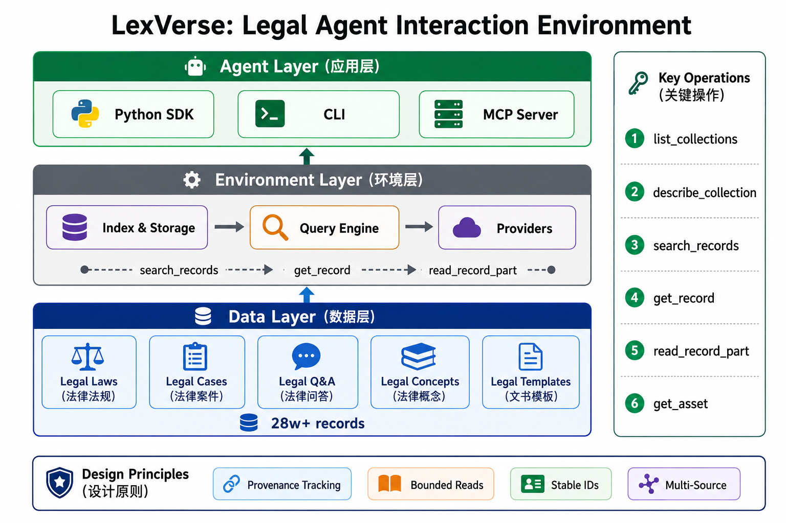

<h1 align="center">LexVerse: An Interaction Environment for Chinese Legal Agents</h1>

<p align="center">
  <a href="examples/lexverse_tutorial.ipynb">📓 Tutorial Notebook</a> ·
  <a href="#quick-start">🚀 Quick Start</a> ·
  <a href="#using-lexverse">📖 Usage</a>
</p>

---

LexVerse is an interaction environment for Chinese legal agents. It organizes laws, cases, legal questions, legal concepts, and document templates behind a unified interface for search, retrieval, provenance, and controlled data access.

> 💡 **New to LexVerse?** Start with [`examples/lexverse_tutorial.ipynb`](examples/lexverse_tutorial.ipynb) — a runnable Jupyter notebook covering all core APIs with real data.

## The LexVerse Environment

LexVerse is organized into three layers.

<p align="center">
  
</p>

## Data Collections

| Collection          | Description                                                     |
| ------------------- | --------------------------------------------------------------- |
| `legal_laws`      | Laws, regulations, judicial interpretations, and legal articles |
| `legal_cases`     | Cases and judicial decisions                                    |
| `legal_qa`        | Legal questions and scenario data                               |
| `legal_concepts`  | Legal terms, concepts, and definitions                          |
| `legal_templates` | Document templates and registered assets                        |

### Dataset Sources and Attribution

The table below maps each dataset currently used by LexVerse to its online source. The links identify the upstream project, dataset release, or official source page. Using these sources does not change the original dataset's license or attribution requirements.

| Collection | Dataset / source                                                                             |
| ---------- | -------------------------------------------------------------------------------------------- |
| QA         | [J1Bench (LC, KQ)](https://github.com/FudanDISC/J1Bench)                                      |
| QA         | [法答网 (Fadawang)](https://www.court.gov.cn/search.html?content=%E6%B3%95%E7%AD%94%E7%BD%91) |
| QA         | [DLawBench](https://github.com/SKYLENAGE-AI/DLawBench)                                        |
| Concepts   | [中文法律术语汇编](https://terms.legalhub.cn/)                                                |
| Concepts   | [OwnThink](https://github.com/ownthink/KnowledgeGraphData)                                    |
| Cases      | [J1Bench (CI, CR)](https://github.com/FudanDISC/J1Bench)                                      |
| Cases      | [AgentsCourt / SimuCourt](https://github.com/Hezhitao2021/SimuCourt)                          |
| Cases      | [Legal-world](https://github.com/chidaic/Legal-world)                                         |
| Cases      | [MASER](https://github.com/FudanDISC/MASER)                                                   |
| Cases      | [JuDGE](https://github.com/oneal2000/JuDGE)                                                   |
| Cases      | [LeCaRDv2](https://github.com/THUIR/LeCaRDv2)                                                 |
| Cases      | [MSLR-Bench](https://github.com/yuwenhan07/MSLR-Bench)                                        |
| Cases      | [MUSER](https://github.com/THUlawtech/MUSER)                                                  |
| Cases      | [LexChain](https://github.com/thunlp/LexChain)                                                |
| Laws       | [LawRefBook / Laws](https://github.com/RanKKI/LawRefBook)                                     |
| Templates  | [最高人民法院、中国法院网文书模板](https://law.wkinfo.com.cn/document-templates/list)         |

For record-level provenance, use the `provenance` field returned by the SDK/API. It identifies the collection, source, relative path, and snapshot used for a record.

## Quick Start

Python 3.10+ is required.

The source data is published separately as the Hugging Face dataset
[`mjyanna/LexVerse-data`](https://huggingface.co/datasets/mjyanna/LexVerse-data)
and is intentionally not stored in this Git repository. Download it before
building the local index:

```bash
python -m pip install -U huggingface_hub
huggingface-cli download mjyanna/LexVerse-data \
  --repo-type dataset \
  --local-dir ./data
```

If the dataset is private, authenticate first with `huggingface-cli login`.
The dataset is about 3.2 GB and contains files from multiple upstream
projects; review the upstream licenses and attribution requirements before
redistributing it.

```bash
git clone <your-repository-url>
cd LexVerse
python -m pip install -e .

# Inspect registered sources
lexverse-env inventory --data-dir ./data --state-dir ./.lexverse

# Build the local index
lexverse-env build-index \
  --data-dir ./data \
  --state-dir ./.lexverse \
  --progress

# Check the index and sample records
lexverse-env doctor --data-dir ./data --state-dir ./.lexverse
```

For development, add `--max-records 100` to build a small partial index.

## Using LexVerse

### Common Workflow

The standard interaction pattern is:

```text
list_collections
    -> describe_collection
    -> search_records
    -> get_record
    -> read_record_part / get_asset
```

Run these steps in order: search first, then read the records returned by the search. Use `read_record_part` for a large field and `get_asset` only after a template record returns an asset ID.

### How to Use

Python SDK, CLI, and MCP Server expose the same environment operations. Choose one entry point; you do not need to use all three. For a first run, the Python SDK is the easiest way to see each response.

- Use the **Python SDK** to write programs and integrate an Agent.
- Use the **CLI** to inspect data from a terminal.
- Use the **MCP Server** to connect LexVerse to another Agent client.

#### Python SDK

```python
from lexverse_env import CorpusEnv

with CorpusEnv.open("data", ".lexverse") as env:
    print(env.list_collections())
    print(env.describe_collection("legal_laws"))

    page = env.search_records(
        collection="legal_laws",
        query="劳动合同解除",
        limit=5,
    )

    for item in page["items"]:
        record = env.get_record(item["id"])
        print(record["provenance"])
        print(record["record"])
```

Search results contain stable IDs and minimal key fields. Read large fields in bounded slices with a JSON Pointer:

```python
part = env.read_record_part(
    record_id,
    path="/documents/0/content",
    offset=0,
    limit=12000,
)
```

Pass `next_cursor` and `next_offset` back unchanged when continuing a query or a record read.

#### CLI

Search records:

```bash
lexverse-env search \
  --data-dir ./data \
  --state-dir ./.lexverse \
  --collection legal_cases \
  --query "劳动合同解除" \
  --limit 5
```

Read a record returned by search:

```bash
lexverse-env get \
  --data-dir ./data \
  --state-dir ./.lexverse \
  "<record-id>"
```

#### MCP Server

Install the optional MCP dependency and start the stdio server:

```bash
python -m pip install -e '.[mcp]'
export LEXVERSE_DATA_DIR=/path/to/LexVerse/data
export LEXVERSE_STATE_DIR=/path/to/LexVerse/.lexverse
lexverse-mcp
```

The server exposes the same operations as the SDK:

```text
list_collections       describe_collection
search_records         get_record
read_record_part       get_asset
get_manifest
```

### External Integrations

#### Pkulaw MCP

Pkulaw is an optional external Provider. Configure it in an external MCP client or secret manager, then inject a synchronous bridge:

```python
from lexverse_env import CorpusEnv, PkulawMcpProvider

pkulaw = PkulawMcpProvider(
    call_tool=my_synchronous_mcp_bridge,
    service_id="verified-service-id",
    search_tool="verified-search-tool",
    get_tool="verified-get-tool",
    map_search=my_search_mapper,
    map_get=my_get_mapper,
)

with CorpusEnv.open("data", ".lexverse", pkulaw_provider=pkulaw) as env:
    page = env.search_records(
        collection="legal_laws",
        provider="pkulaw",
        query="劳动合同解除",
        limit=5,
    )
```

Verify the remote tool names and schemas with `tools/list` before configuring the Provider. Keep credentials outside the repository.

## Extending LexVerse

### Add a Data Source

Register the source, select a loader, define its projection, and rebuild the index:

```text
JSON/JSONL source
    -> SourceRegistry entry
    -> loader
    -> searchable and filter projections
    -> index build
```

Source registration and projections live primarily in `lexverse_env/registry.py`; loader implementations live in `lexverse_env/loaders.py`.

### Add a Collection

A collection should define:

- a stable collection name;
- file patterns and loader type;
- searchable and filter fields;
- minimal key fields for search responses;
- source and provenance behavior.

New collections should use the same public calls:

```python
env.search_records(collection="new_collection", query="...")
env.get_record(record_id)
```

### Add an External Provider

Implement the Provider contract and keep the public environment API unchanged:

```python
class CustomProvider:
    name = "custom"

    @property
    def available(self) -> bool:
        ...

    def search(self, request):
        ...

    def get(self, record_id):
        ...
```

Use explicit provider selection from an Agent:

```python
env.search_records(
    collection="legal_cases",
    provider="custom",
    query="合同纠纷",
)
```

External IDs should be namespaced so they cannot be confused with local records. `PkulawMcpProvider` is the reference implementation.

### Add an MCP Tool

Add the corresponding Python environment method first, then expose it through `lexverse_env/mcp_server.py`. Keep argument validation and error conversion in the environment layer, and keep MCP stdout reserved for JSON-RPC messages.

## Design Boundaries

- Data access is limited to registered collections and data roots.
- Callers use stable record and asset IDs instead of physical paths.
- Large records and attachments are read through bounded interfaces.
- Search and record responses retain source and snapshot information.
- External Providers are called only when explicitly configured and selected.

## Project Structure

```text
LexVerse/
├── data/              # Downloaded from the Hugging Face dataset repository
├── lexverse_env/      # SDK, index, Providers, and MCP Server
├── examples/          # Runnable tutorial notebook
├── tests/             # Unit tests
├── img/               # Architecture diagrams
└── .lexverse/         # Generated local index
```

## License

Dataset licenses and usage restrictions remain governed by the original sources; preserve `provenance` when using records.
